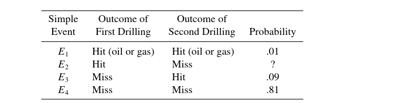

### Christopher Munoz

2.1) Suppose a family contains two children of different ages, and we are interested in the gender of these children. Let $F$ denote that a child is female and $M$ that the child is male and let a pair such as $F,M$ denote that the older child is female and the younger is male. There are four points in the set S of possible observations:$$S = \{F F, F M, M F, M M\}.$$Let $A$ denote the subset of possibilities containing no males; $B$, the subset containing two males; and $C$, the subset containing at least one male. List the elements of $A, B, C, A  B, A  B, A  C, A  C, B  C, B  C,$ and $C  \overline{B}$.\
\
$$ A = \{FF\} \qquad B = \{MM\} \qquad C = \{FM, MF, MM\}$$ $$A \cap B = \emptyset \qquad A\cup B = \{MM,FF\} \qquad A \cap C = \emptyset$$ $$A \cup C = S = \{FF, FM, MF, MM\} \qquad B \cap C = \{MM\} $$ $$
B \cup C = C = \{FM, MF, MM\} \qquad C \cap \overline{B} = \{FM, MF\} $$\

2.2) Suppose that A and B are two events. Write expressions involving unions, intersections, and complements that describe the following:\
a Both events occur.\
b At least one occurs.\
c Neither occurs.\
d Exactly one occurs.\
\
$$a = A \cap B \qquad b = A \cup B \qquad C = \overline{A \cap B} \qquad d = (A \cap \overline{B} \cup B \cap \overline{A})$$

2.8) From a survey of 60 students attending a university, it was found that 9 were living off campus, 36 were undergraduates, and 3 were undergraduates living off campus. Find the number of these students who were\
a undergraduates, were living off campus, or both.\
b undergraduates living on campus.\
c graduate students living on campus.\

$$
a = 42 \qquad b = 33 \qquad c = 24 - 6 = 18
$$

\
2.9) Every persons blood type is A, B, AB, or O. In addition, each individual either has the Rhesus (Rh) factor (+) or does not (-). A medical technician records a persons blood type and Rh factor. List the sample space for this experiment\

$$
\text{Sample Space} = \{A-, B-, AB-, O-, A+, B+, AB+, O+\}
$$\
\
2.10)The proportions of blood phenotypes, A, B, AB, and O, in the population of all Caucasians in the United States are approximately .41, .10, .04, and .45, respectively. A single Caucasian is chosen at random from the population.\
a List the sample space for this experiment.\

$$
\text{Sample space } = \{A, B, AB, O\}
$$\
b Make use of the information given above to assign probabilities to each of the simple\
events\

$$P(A) = 0.41 \qquad P(B) = 0.10 \qquad P(AB) = 0.04 \qquad P(O) =0.45 $$\
. c What is the probability that the person chosen at random has either type A or type AB blood?\

$$
P(A) \cup P(AB) = 0.41 + 0.04 = 0.45
$$\

2.11) A sample space consists of five simple events, $E_1, E_2, E_3, E_4,$ and $E_5$.\
\
a If $P(E_1) = P(E_2) = 0.15, P(E_3) = 0.4$, and $P(E_4) = 2P(E_5)$, find the probabilities of $E_4$ and $E_5$.\
$$
(P(E_1) + P(E_2)) + P(E_3) = 0.30 + 0.40 = 0.70,$$\
$$\text{ so  } P(E_4) + P(E_5) = 0.30 $$

$$ \text{since } P(E_4) = 2P(E_5), \text{ that means } P(E_4) = 0.20 \text{ and } P(E_5) = 0.10.$$\

b If $P(E_1) = 3P(E_2) = 0.3$, find the probabilities of the remaining simple events if you know that the remaining simple events are equally probable.\

$$
P(E_1) = 0.1 \qquad P(E_2) = 0.3 \qquad P(E_3) = P(E_4) = P(E_5) = 0.2
$$

\
\
2.13) Americans can be quite suspicious, especially when it comes to government conspiracies. On the question of whether the U.S. Air Force has withheld proof of the existence of intelligent life on other planets, the proportions of Americans with varying opinions are given in the table.\
\
\
Suppose that one American is selected and his or her opinion is recorded.\
a What are the simple events for this experiment?\
Let

$$VT = \text{Very likely} \qquad SL = \text{Somewhat likely}$$$$U = \text{ Unlikely} \qquad O = \text{Other}$$\
b Are the simple events that you gave in part (a) all equally likely? If not, what are the probabilities that should be assigned to each?\

$$\text{The probability of simple events above are not equally likely as } $$$$P(VT) = .24 \qquad P(SL) = .24 \qquad P(U) = .40 \qquad P(O) = .12$$$$\text{Though } P(VT) = P(SL).$$\
\
c What is the probability that the person selected finds it at least somewhat likely that the Air Force is withholding information about intelligent life on other planets?

$$P(VT) \cup P(SL) = .24 + .24 = .48$$\
\
2.14) A survey classified a large number of adults according to whether they were diagnosed as needing eyeglasses to correct their reading vision and whether they use eyeglasses when reading. The proportions falling into the four resulting categories are given in the following table\
\
\
If a single adult is selected from the large group, find the probabilities of the events defined\
below. The adult\
a needs glasses.\

$$.44 + .14 = .58$$\
b needs glasses but does not use them.

$$.14$$\
c uses glasses whether the glasses are needed or not.\

$$
.44+.02 = .46
$$

2.15) An oil prospecting firm hits oil or gas on 10% of its drillings. If the firm drills two wells, the four possible simple events and three of their associated probabilities are as given in the accompanying table. Find the probability that the company will hit oil or gas\
\
a on the first drilling and miss on the second.

$$0.09$$\
b on at least one of the two drillings

$$
0.01 + 0.09 + 0.09 = 0.19
$$\
\
2.27) In Exercise 2.12 we considered a situation where cars entering an intersection each could turn right, turn left, or go straight. An experiment consists of observing two vehicles moving through the intersection.\
a How many sample points are there in the sample space? List them.\

$$3^2 = 9 \text{ sample points}$$ $$S = \{CC, LL, RR, CL, CR, RL, LR, RC, LC\}$$\
b Assuming that all sample points are equally likely, what is the probability that at least one car turns left?

$$\frac{5}{9}$$\
c Again assuming equally likely sample points, what is the probability that at most one vehicle turns?

$$
\frac{5}{9}
$$\

2.29) Two additional jurors are needed to complete a jury for a criminal trial. There are six prospective jurors, two women and four men. Two jurors are randomly selected from the six available.\
a Define the experiment and describe one sample point. Assume that you need describe only the two jurors chosen and not the order in which they were selected.\

$$\text{The experiment involves choosing 2 jurors from a total selection of 6}$$\
$$\text{constisting of 2 women and 4 men. An example sample point would be } A = \{F_1M_2\} $$\
\
b List the sample space associated with this experiment.\

$$S = \{F_1F_2, F_1M_1, F_1M_2, F_1M_3, F_1M_4, F_2M_1, F_2M_2, F_2M_3,F_2M_4$$

$$M_1M_2,M_1M_3,M_1M_4, M_2M_3,M_2M_4,M_3M_4\}$$\
c What is the probability that both of the jurors selected are women?\

$$\frac{1}{15}$$\
\
\
2.33) The Bureau of the Census reports that the median family income for all families in the United States during the year 2003 was \$43,318. That is, half of all American families had incomes exceeding this amount, and half had incomes equal to or below this amount. Suppose that four families are surveyed and that each one reveals whether its income exceeded \$43,318 in 2003.\
a List the points in the sample space.\
$$\text{Let G denote a families with incomes exceeding \$43,318.}$$\
$$\text{Let L denote families with income at or below \$43,318.}$$\
$$\text{Let S denote our sample space and the subscript the index of an event}$$\
$$S = \{GGGG, GGGL, GGLG, GLGG, LGGG, GGLL, GLGL, LGGL $$\
$$GLLG,LGLG,LLGG,GLLL,LGLL,LLGL,LLLG,LLLL\}$$

b Identify the simple events in each of the following events: A: At least two had incomes exceeding \$43,318. B: Exactly two had incomes exceeding \$43,318. C: Exactly one had income less than or equal to \$43,318.\

$$A = S_1, S_2,S_3,S_4,...S_{11} \qquad B = S_6,S_7,S_8,...S_{11} \qquad C = S_2,S_3,S_4,S_5 $$ \
c Make use of the given interpretation for the median to assign probabilities to the simple events and find P(A), P(B), and P(C).\
\
$$P(A) = 11/16 \qquad P(B) = 6/16 \qquad P(C) = 4/16$$

\
2.35) An airline has six flights from New York to California and seven flights from California to Hawaii per day. If the flights are to be made on separate days, how many different flight arrangements can the airline offer from New York to Hawaii?\

$$42 \text{ flights}$$\
\
2.37) A businesswoman in Philadelphia is preparing an itinerary for a visit to six major cities. The distance traveled, and hence the cost of the trip, will depend on the order in which she plans her route.\
a How many different itineraries (and trip costs) are possible?

$$6! = 720$$\
b If the businesswoman randomly selects one of the possible itineraries and Denver and San Francisco are two of the cities that she plans to visit, what is the probability that she will visit Denver before San Francisco?

$$\text{Half of them, so 0.5}$$\
\
2.41)How many different seven-digit telephone numbers can be formed if the first digit cannot be zero?\

$$10^7 - 1,000,000 = 9,000,000$$\
\
2.43) A fleet of nine taxis is to be dispatched to three airports in such a way that three go to airport A, five go to airport B, and one goes to airport C. In how many distinct ways can this be accomplished?\
\

$${9 \choose 3} * {6 \choose 5} * {1 \choose 1} = {9 \choose 3,5,1} = 504 $$\
\
2.49)Students attending the University of Florida can select from 130 major areas of study. A student’s major is identified in the registrar’s records with a two-or three-letter code (for example, statistics majors are identified by STA, math majors by MS). Some students opt for a double major and complete the requirements for both of the major areas before graduation. The registrar was asked to consider assigning these double majors a distinct two- or three-letter code so that they could be identified through the student records’ system. \
a What is the maximum number of possible double majors available to University of Florida students?

$${130 \choose 2} = 8385$$\
b If any two- or three-letter code is available to identify majors or double majors, how many major codes are available?

$$26^2 + 26^3 = 18252$$\
c How many major codes are required to identify students who have either a single major or a double major? \

$$8385 + 130 =  8515$$\
d Are there enough major codes available to identify all single and double majors at the University of Florida?\

$$\text{Yes there are}$$\
\
2.51) local fraternity is conducting a raffle where 50 tickets are to be sold—one per customer. There are three prizes to be awarded. If the four organizers of the raffle each buy one ticket, what is the probability that the four organizers win\
a all of the prizes? \
$$\text{Total is } {50 \choose 3} = 19600 \text{ so, }$$\
$$4/19600.$$\
b exactly two of the prizes?\

$${4 \choose 2}*{46 \choose 1} = 276, \text{ so, } 276 / 19600.$$\
c exactly one of the prizes?

$${46 \choose 2} * {4 \choose 1} = 4140, \text{ so, } 4140/19600.$$\
d none of the prizes?\

$${46 \choose 3} = 15,180, \text{ so, } 15180,19600.$$\
2.55) A study is to be conducted in a hospital to determine the attitudes of nurses toward various administrative procedures. A sample of 10 nurses is to be selected from a total of the 90 nurses employed by the hospital. \
a How many different samples of 10 nurses can be selected?

$${90 \choose 10}$$\
b Twenty of the 90 nurses are male. If 10 nurses are randomly selected from those employed by the hospital, what is the probability that the sample of ten will include exactly 4 male (and 6 female) nurses?\

$${20 \choose 4} * {70 \choose 6} / {90 \choose 10} = 0.111$$\
\
2.57)Two cards are drawn from a standard 52-card playing deck. What is the probability that the draw will yield an ace and a face card?\

$${52 \choose 2} = 1326$$\
$$4* 12 / 1326 = 0.0362$$\
\
\
2.59) Five cards are dealt from a standard 52-card deck. What is the probability that we draw \
a 1 ace, 1 two, 1 three, 1 four, and 1 five (this is one way to get a “straight”)?\
$${52 \choose 5} = 2598960$$\
$$4^5 /2598960 = 0.000394$$\
b any straight?\
\

$$
9 * 4^5 /2598960 = 0.00355
$$
